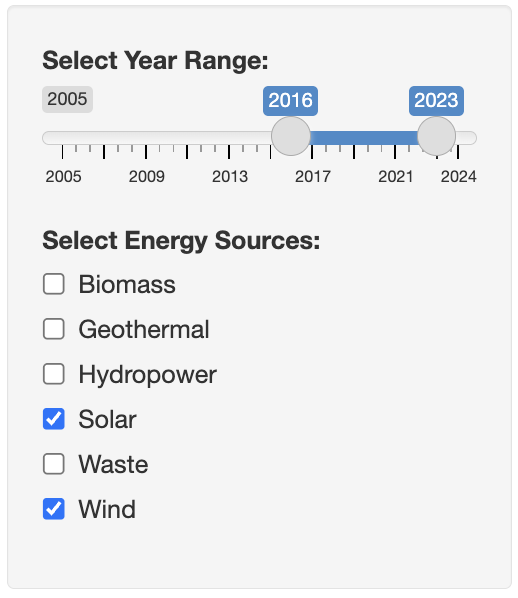
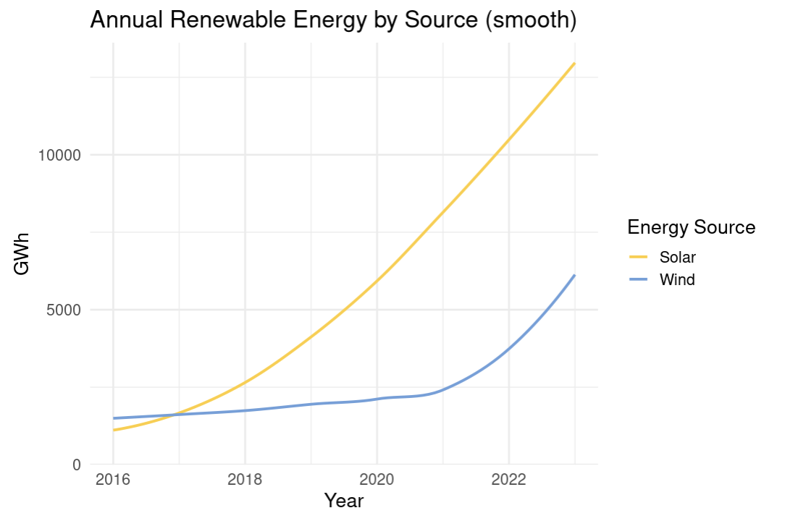
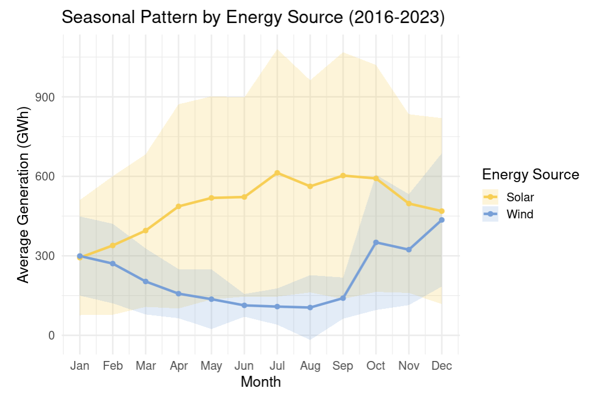

## 🌍 Interaction Dashboard: Taiwan Renewable Energy Explorer

[⬅ Back to R results](README.md) | [⬅ Back to Project Overview](../README.md)

---

### 🔹 Goal
This dashboard is an interactive tool for understanding Taiwan's renewable energy trends. It provides a simple, flexible way to quickly view and compare energy generation data across different years and sources.

> 💡
> - Fast Answers: Quickly see energy production totals and monthly trends without complex analysis.
> - Dynamic Comparison: Easily compare the performance of solar vs. wind, or compare the same source across different years.
> - Find Seasonal Patterns: Instantly visualise monthly data to see when generation peaks or dips.

---

### 🔹 How to use

The dashboard is split into two main areas: Controls (Left) and Visuals (Right).

- **Controls (Left):** Select year(s) and energy source(s)  

     

- **Visuals (Right):** Charts update automatically and instantly based on your selections.

  Annual Summary: Displays the total generation for all selected sources and years. Great for high-level comparisons.  
  
     

  Monthly Trend: Shows the detailed Monthly pattern for the selected source(s). This is key for identifying seasonal trends and peak months.    
  
   
---

### 🔹 Future Possibilities

This dashboard is continuously improving to offer deeper insights:
- Model Benchmarking: Soon, you can view and compare the accuracy of different energy forecasting models (like ARIMA) right here.
- Forecasting View Refinement: Enhancing the current forecast visualisation to include confidence intervals, making model results easier to interpret.

---

[⬅ Back to R results](README.md) | [⬅ Back to Project Overview](../README.md)
