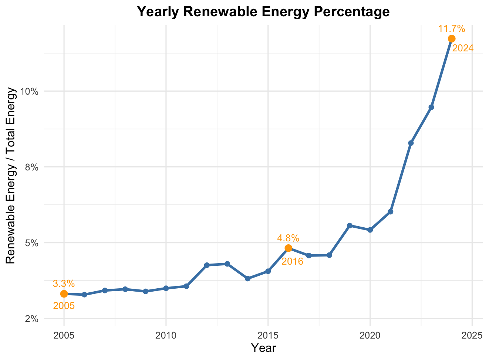

## 📊 Data Exploration (EDA)

 [⬅ Back to R results](README.md) | [⬅ Back to Project Overview](../README.md)

This document presents the **Exploratory Data Analysis (EDA)** of Taiwan's renewable energy generation from 2005 to 2024.  
We examine **annual trends**, **seasonal patterns**, and highlight the most significant contributors.

---

### 🔹 Annual Renewable Energy Percentage

> **Insight:** The renewable energy share has steadily increased, more than doubling since 2016, reflecting Taiwan’s policy-driven.

### 🔹 Annual Trends by Energy Source

The table below shows the total annual generation by energy source for 2005, 2016, and 2024,  
as well as the growth rate from 2016 to 2024.  

| Energy Source | 2005 (GWh) | 2016 (GWh) | 2024 (GWh) | Growth (2016→2024) |
|---------------|-----------:|-----------:|-----------:|------------------: |
| Solar         | 1          | 1,109      | 15,296     | +1279%             |
| Wind          | 91         | 1,457      | 10,510     | +621%              |
| Hydropower    | 4,071      | 6,562      | 4,208      | -36%               |
| Geothermal    | 0          | 0          | 27         | ---                |
| Biomass       | 323        | 205        | 238        | +16%               |
| Waste         | 3,054      | 3,397      | 3,638      | +7%                |

> **Insights:**  
> - Solar and Wind are the fastest-growing sources in Taiwan.  
> - Hydropower decreased in 2024 compared to 2016, likely due to water availability or operational adjustments.  
> - Geothermal has only started contributing recently.  
> - Biomass and Waste remain relatively stable.  

### 🔹 Seasonal Patterns

Seasonal variation differs by energy source:

- **Solar:** Peaks in summer months, lower in winter.  
- **Wind:** Peaks in winter months, moderate in other seasons.  
- **Hydropower:** Fluctuates with rainfall and water availability.  
- **Others (Geothermal, Biomass, Waste):** Minimal seasonal variation.

> The plot highlights the average monthly generation (GWh) for Solar and Wind, with shaded areas representing standard deviation across years.  

### 🔹 Explore Interactive Results

For interactive exploration of seasonal and annual trends:

> 🌍 **Open the Shiny Dashboard:** [Click here](https://ling-yun-huang.shinyapps.io/interactiondashboard/)  

> 💡 **Dashboard Instructions:**  
> 1. Select a year range with the slider.  
> 2. Choose one or more energy sources.  
> 3. Explore annual trends and seasonal patterns.  
> 4. Compare energy sources using checkboxes.  

For a detailed guide with screenshots, see [Shiny Dashboard Instructions](Dashboard.md)

---

➡️ Next step: evaluate **forecasting models** using this historical data in [📈 Model Comparison](Model.md)  

[⬅ Back to R results](README.md) | [⬅ Back to Project Overview](../README.md)

