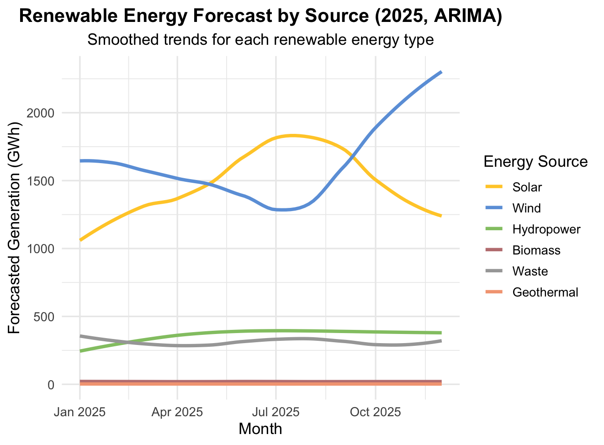
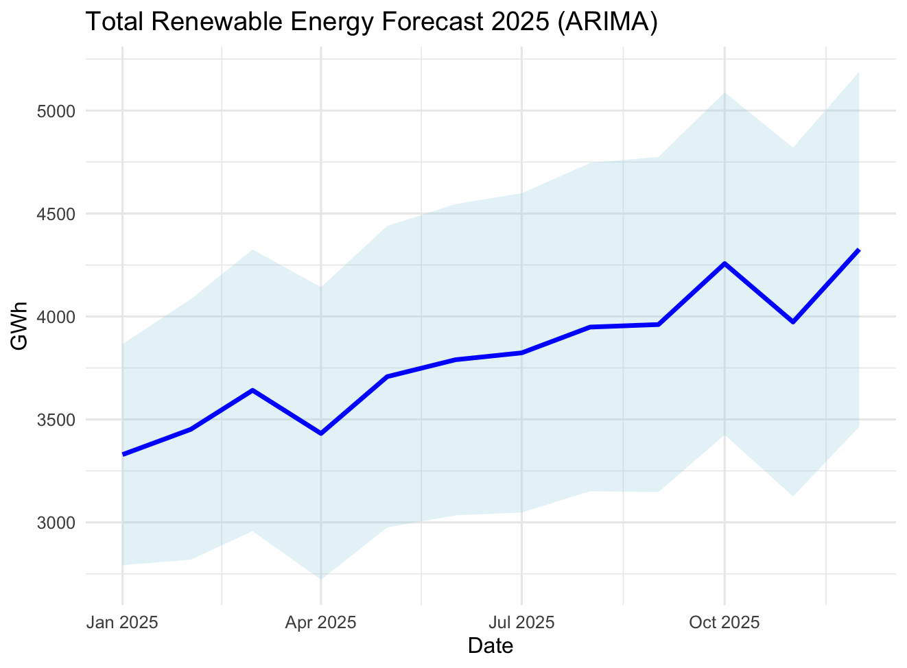
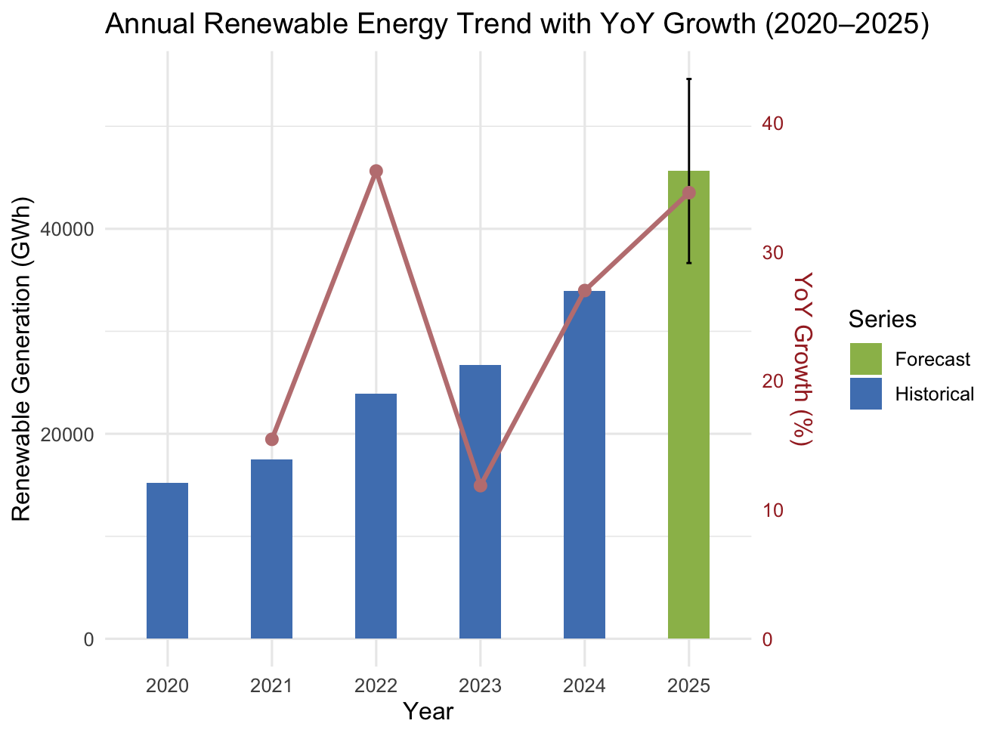
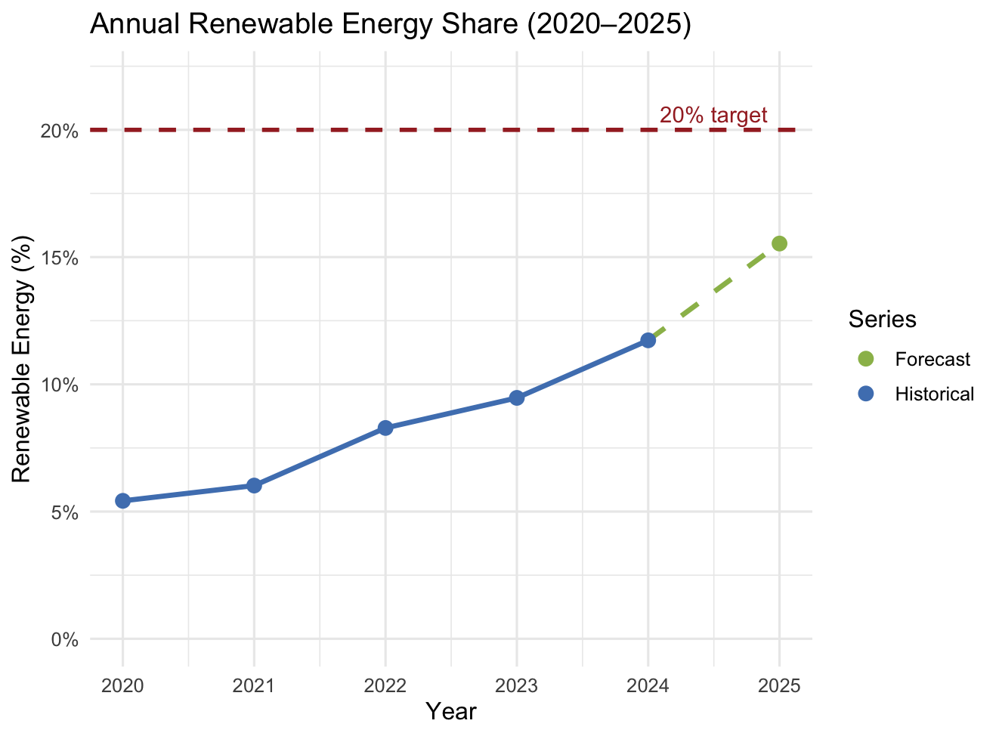

## 🔮 Forecasting 2025 Renewable Energy Generation

[⬅ Back to R results](README.md) | [⬅ Back to Project Overview](../README.md)

---

### 📈 Forecast Objective

- Building upon *the best-performing model (ARIMA)* identified in the model validation stage, this section projects Taiwan’s **2025 renewable energy generation** to evaluate progress toward the **20% renewable energy goal**.
- Forecasts were generated for each renewable source from 2005-2024 and then aggregated to obtain the total projected renewable generation for 2025.

---

### 🔹 Monthly Forecast Trend

  
  

> Solar and wind dominate, showing clear seasonal patterns, while other sources remain stable.  
> Total renewable generation is expected to grow steadily to 2025.

### 🔹 Annual Forecast Summary

<table>
<tr>
<td>

</td>
<td style="vertical-align: top; padding-left: 20px;">
<table>
  <tr><th>Year</th><th>Renewable (GWh)</th></tr>
  <tr><td>2024 (actual)</td><td>33,917</td></tr>
  <tr><td>2025 (forecast)</td><td>45,640</td></tr>
  <tr><td>Growth (2024-2025)</td><td>+34.6%</td></tr>
</table>
</td>
</tr>
</table>

#### 🔹 Detail by Sources

| Energy Source | 2024 Actual (GWh) | 2025 Forecast (GWh) | Growth (%) | Key Driver                         |
| ------------- | ----------------: | ------------------: | ---------: | ---------------------------------- |
| **Solar**     |            15,296 |              17,534 | **+14.7%** | New PV capacity & rooftop adoption |
| **Wind**      |            10,510 |              19,773 | **+88.2%** | Offshore wind projects scaling up  |
| Hydropower    |             4,208 |               4,319 |      +2.6% | Limited expansion potential        |
| Geothermal    |                27 |                  25 |      −7.4% | Negligible output scale            |
| Biomass       |               238 |                 240 |      +0.8% | Stable operation                   |
| Waste         |             3,638 |               3,749 |      +3.0% | Stable operation                   |

---

### 🔹 Trend and Target Assessment

  

Despite continued growth, projections indicate:
- Taiwan may reach ~15% renewable share by 2025.
- Additional acceleration is needed to meet the 20% target.

---

### 🔹 Summary Insights

- **Model:** ARIMA (best 2024 performance)
- **Forecast year:** 2025 (data: 2005–2024)
- **Expected renewable share:** ~15% of total generation
- **Main growth drivers:** Solar and wind
- **Challenge:** Pace insufficient to reach 20% by 2025

---

➡️ **Next step:** Explore the interactive dashboard built with Shiny: [🌍 Shiny Dashboard](Dashboard.md)

---

[⬅ Back to R results](README.md) | [⬅ Back to Project Overview](../README.md)

