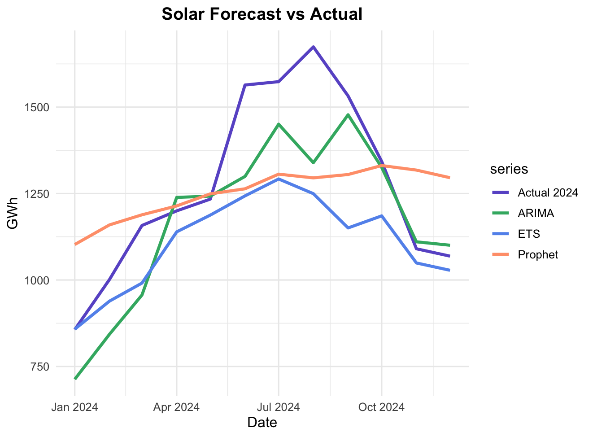
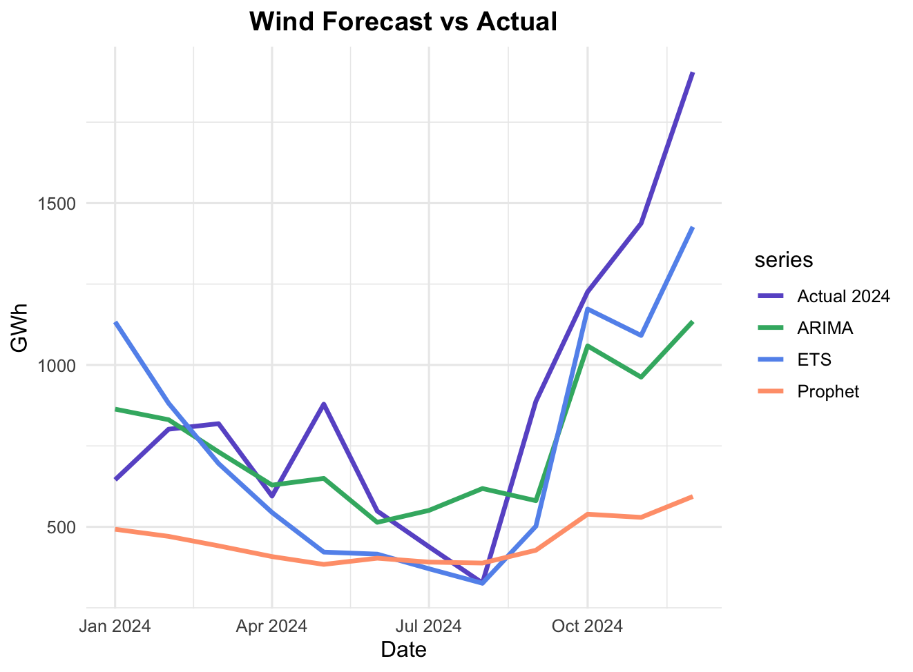

> 🧩 This section is **work in progress** – ⏳ *Last updated: October 2025*

## 📈 Time-Series Models Comparison

[⬅ Back to R results](README.md) | [⬅ Back to Project Overview](../README.md)

In this section, three time-series models — **ETS**, **ARIMA**, and **Prophet** — were evaluated to identify the most accurate approach for forecasting Taiwan’s renewable energy generation.

Each energy source (*Solar, Wind, Hydropower,* etc.) was modeled individually using historical data from **2005–2023**.  
However, to ensure comparability, model performance was assessed based on the **aggregated total renewable generation**, validated against **actual 2024 data**.

---

### 🔹 Models Overview

| Model       | Method Type                                               | Strengths                                    | Limitations                        |
| ----------- | --------------------------------------------------------- | -------------------------------------------- | ---------------------------------- |
| **ETS**     | Exponential smoothing                                     | Captures trend and seasonality automatically | May underperform on irregular data |
| **ARIMA**   | Autoregressive Integrated Moving Average                  | Flexible for trend and correlation patterns  | Requires differencing and tuning   |
| **Prophet** | Additive model with trend + seasonality + holiday effects | Handles multiple seasonality well            | May overfit on short data          |

> All models were implemented in R (`forecast` and `prophet` packages).

Each model was trained on data from **2005–2023**, then used to forecast **2024**.  
The forecasted results were compared to actual 2024 observations to compute **RMSE** and **MAPE** for model evaluation.

---

### 🔹 Results by Source

  
  

> **Solar and Wind** are the two major contributors to Taiwan’s renewable generation.  
> Both show strong seasonality patterns which are effectively captured by ARIMA and ETS models.  
> Prophet tends to slightly overestimate during off-peak months, likely due to its additive seasonal structure.

For detailed model performance and plots of all six energy sources (*Solar, Wind, Hydropower, Biomass, Waste, Geothermal*), see:  
➡️ [📄 Model Source Details](model_source_detail.md)

---

### 🔹 Overall Results

| Model   | RMSE   | MAPE | Result         |
| ------- | ------ | ---- | -------------- |
| ETS     | 486.56 | 0.15 |                |
| ARIMA   | 317.58 | 0.09 | **Best model** |
| Prophet | 541.55 | 0.15 |                |

> **ARIMA** achieved the lowest error among the three models, demonstrating strong adaptability to the combined renewable energy trend.

---

### 🔹 Conclusion

Based on overall performance, **ARIMA** was selected for subsequent forecasting.  
The next stage applies ARIMA to predict **2025 renewable energy generation**, evaluating whether Taiwan is on track to reach its **20% renewable energy target**.

---

#### 🔜 Next Steps

➡️ Proceed to [🔮 Forecasting 2025](Forecast.md)  
⬅️ Return to [📊 Exploratory Data Analysis](EDA.md)

---

[⬅ Back to R results](README.md) | [⬅ Back to Project Overview](../README.md)
