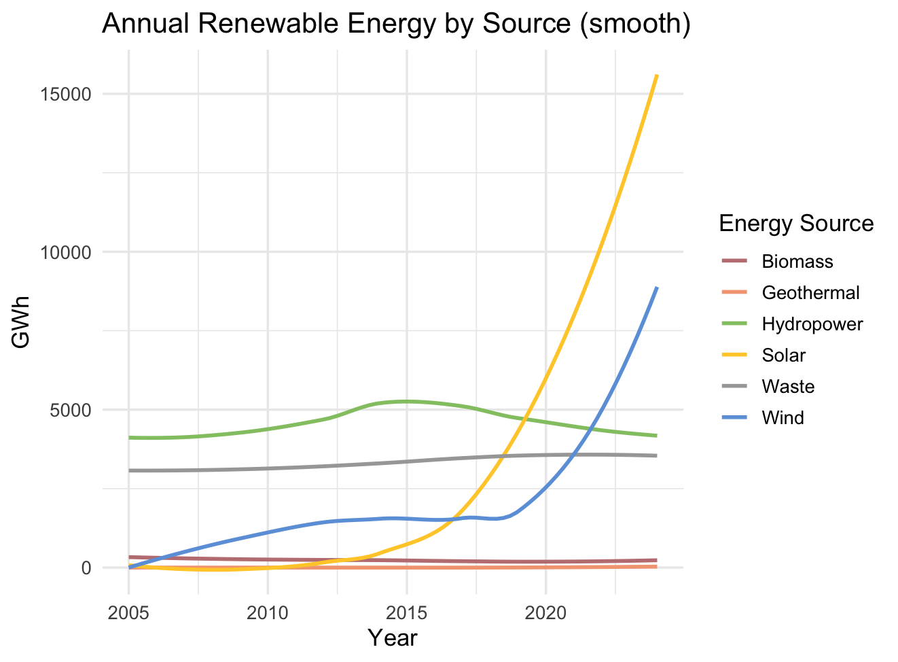
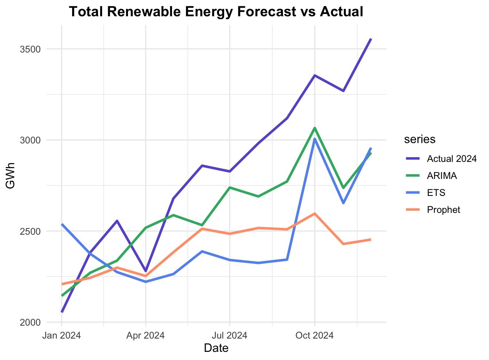
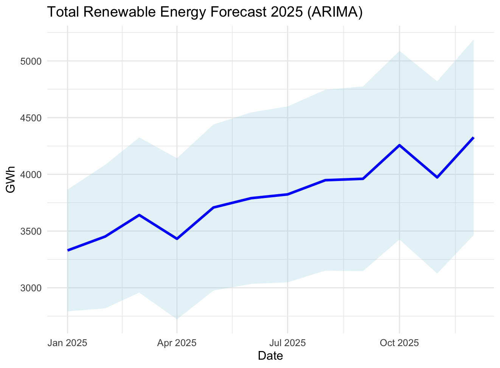

## 📊 Key R Results

These results summarise Taiwan’s renewable energy trends and forecasts based on R analysis and modelling.  
[⬅ Back to Project Overview](../README.md)

---

### 🔹 Annual Renewable Energy Generation (2005–2023)

> Full details (all sources + seasonal patterns) are available in [EDA.md](EDA.md).

| Energy Source | 2005 (GWh) | 2016 (GWh) | 2023 (GWh) | Growth (2016→2023) |
|---------------|-----------:|-----------:|-----------:|------------------:|
| Solar         | 1          | 1,109      | 12,909     | +1064%            |
| Wind          | 91         | 1,457      | 6,201      | +326%             |

> This table highlights the two fastest-growing renewable sources.  

---

### 🔹 Time-Series Models Comparison

> Full details of models' comparison are available in [📈 Model.md](Model.md)

Three forecasting models — *ETS, ARIMA, and Prophet* — were evaluated using data from 2005 to 2023.
Their performance was validated against 2024 data to identify the best model for future forecasts.

| Model   | RMSE    | MAPE  | Result                |
| ------- | ------- | ----- | --------------------- |
| ETS     | 486.56  | 0.15  |                       |
| ARIMA   | 317.58  | 0.09  | *the best model*      |
| Prophet | 541.55  | 0.15  |                       |

---

### 🔹 Forecasts for 2025

> Full details of 2025 Forecasting are available in [🔮 Forecast.md](Forecast.md)

Forecasts were generated using ARIMA, the best-performing model from the previous evaluation.

 

| Energy Source       | Forecast 2025 (GWh) | Contribution to Total (%) |
| ------------------- |-------------------: | ------------------------: |
| Solar               | 17,534              | 5.97%                     |
| Wind                | 19,773              | 6.73%                     |
| Others              |  8,334              | 2.84%                     |
| **Renewable Total** | 45,640              | **15.53%**                |

> Based on trends, Taiwan is unlikely to reach the **20% renewable energy target by 2025**, but 2027 may be realistic.

---

### 🔹 Explore Interactive Results

For interactive charts and seasonal exploration:

> 🌍 **Open the Shiny Dashboard:** [Click here](https://ling-yun-huang.shinyapps.io/interactiondashboard/)  
> 🌍 **Open the Shiny Dashboard:** <a href="https://ling-yun-huang.shinyapps.io/interactiondashboard/" target="_blank">Click here</a>

> 💡 **How to use the Dashboard:**  
> 1. Select the year range with the slider.  
> 2. Choose one or more energy sources to display.  
> 3. Explore annual trends and seasonal patterns.  
> 4. Compare different sources using the checkboxes.  

For a full guide with screenshots, see [Shiny Dashboard Instructions](Dashboard.md)

---

[⬅ Back to Project Overview](../README.md)
