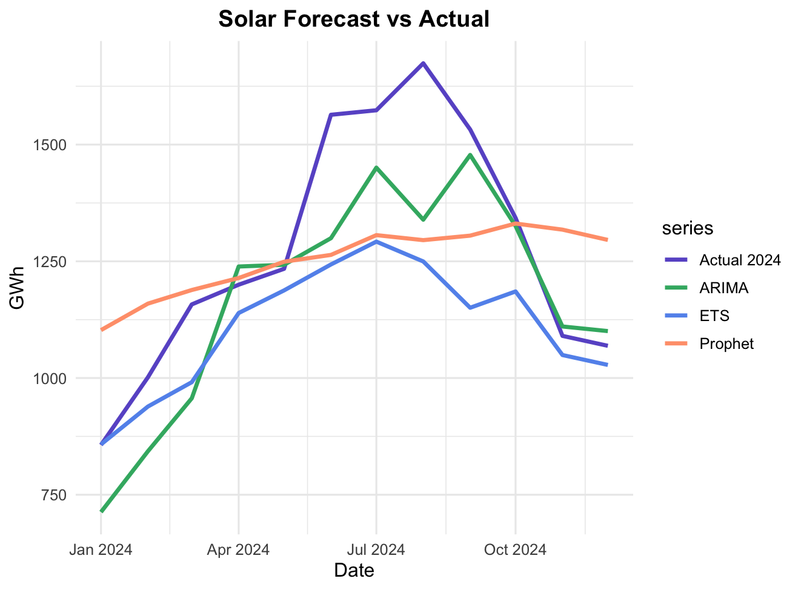

# 📊 Model Source Details

[⬅ Back to Model Comparison](Model.md) | [⬅ Back to Project Overview](../README.md)

This document presents **detailed results for each renewable energy source**, showing model performance and accuracy for **2024 forecasts** using three time-series models — **ETS**, **ARIMA**, and **Prophet**.

---

### 🔹 Forecast vs Actual by Source

Each chart compares the **2024 actual generation** with model forecasts trained on **2005–2023 data**.

  
  
  

  
  
  

---

### 🔹 Model Evaluation Metrics

Model accuracy was evaluated using **RMSE** (Root Mean Square Error) and **MAPE** (Mean Absolute Percentage Error).
Each value reflects how closely the model captured the 2024 generation trend.

  
  

| Energy Source | Best Model  | RMSE | MAPE |                                      Notes |
| ------------- | ----------- | ---: | ---: | -----------------------------------------: |
| Solar         | **ARIMA**   |  155 | 0.09 |    Strong trend capture, stable prediction |
| Wind          | **ETS**     |  288 | 0.25 | Better handling of short-term fluctuations |
| Hydropower    | **ETS**     |  100 | 0.22 | Seasonal variation captured; high variance |
| Biomass       | **ETS**     | 3.42 | 0.16 |              Low variation, good model fit |
| Waste         | **Prophet** | 17.2 | 0.04 |        Smooth pattern, minimal seasonality |
| Geothermal    | **ETS**     | 0.25 | 0.09 |                    Stable since data onset |

---

### 🔹 Insights Summary

* **ETS** performs best for *stable or mature sources* (Hydropower, Biomass, Geothermal).
* **ARIMA** excels for *rapidly growing sources* (Solar).
* **Prophet** suits *steady, low-variance* data (Waste).
* For **Wind**, ETS and ARIMA show comparable accuracy, reflecting high temporal variability.

> Overall, ARIMA was chosen as the best model for total renewable energy forecasting due to its balanced accuracy and adaptability.

---

⬅️ Return to [📈 Model Comparison](Model.md)  
➡️ Proceed to [🔮 Forecasting 2025](Forecast.md)

---

[⬅ Back to R results](README.md) | [⬅ Back to Project Overview](../README.md)
