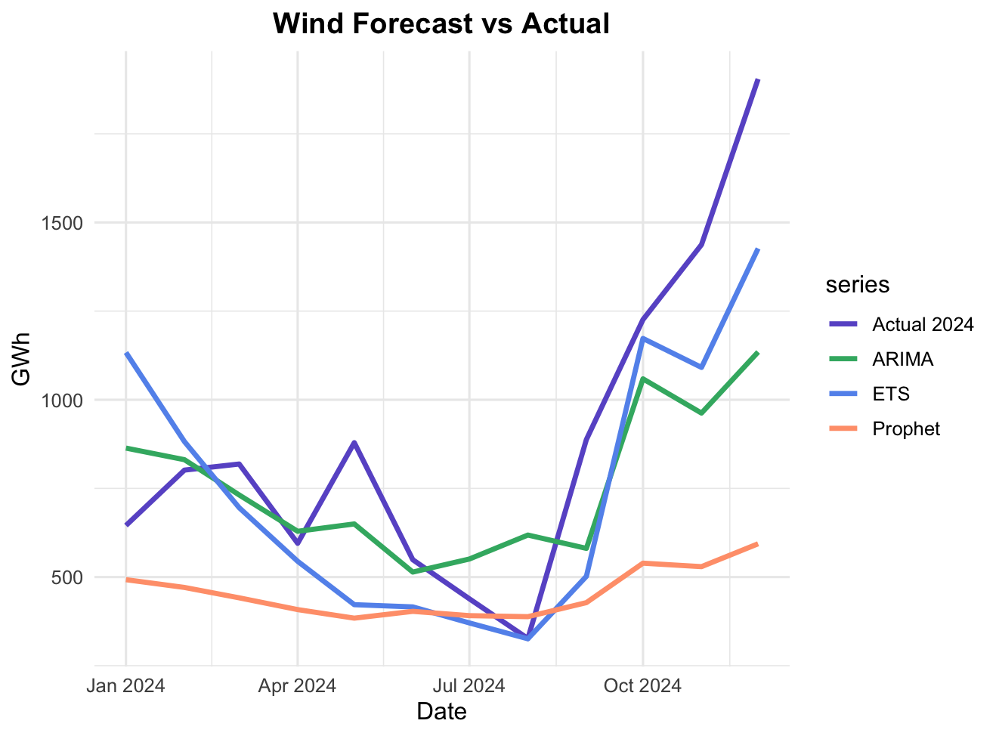
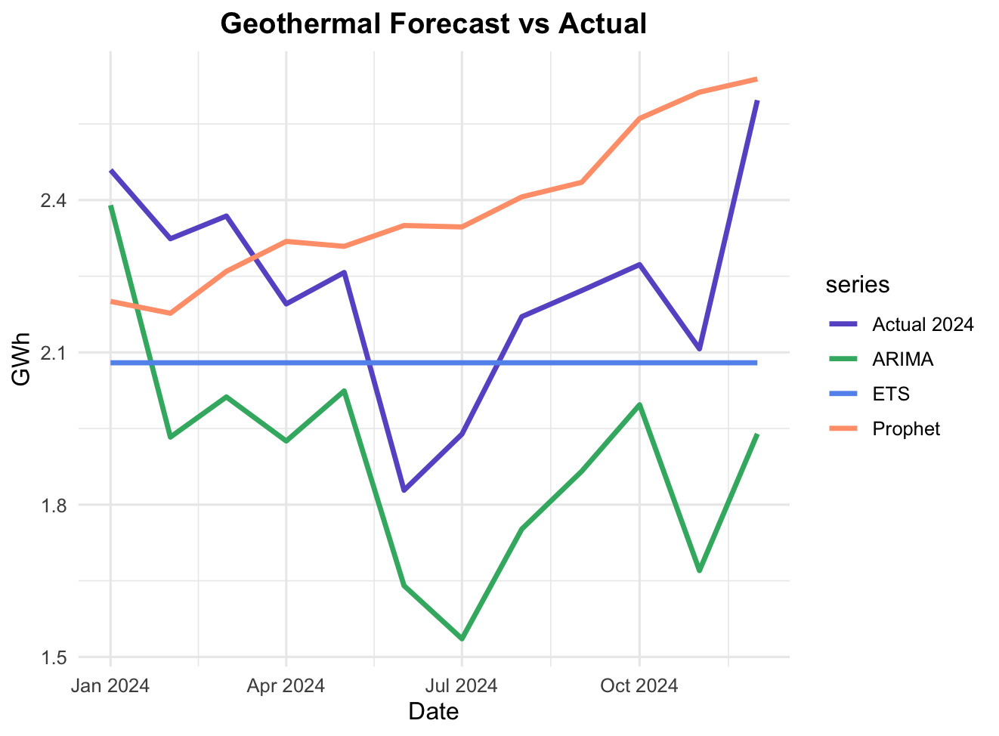

# 📊 Model Source Details

[⬅ Return to Overall Model Comparison](Model.md) | [⬅ Back to R results](README.md) | [⬅ Back to Project Overview](../README.md)

This document provides **detailed model results** for each renewable energy source — including Solar, Wind, Hydropower, Biomass, Waste, and Geothermal — comparing three models (**ETS**, **ARIMA**, **Prophet**) against the actual 2024 data.

---

### 🔹 Forecast vs Actual by Source

  
  

  
  

  
  

Each plot shows 2024 actual generation versus model forecasts for the same period.

---

### 🔹 Model Evaluation

Each model was trained on 2005–2023 data and used to forecast 2024 generation.
Accuracy was assessed using **RMSE** (Root Mean Square Error) and **MAPE** (Mean Absolute Percentage Error).

  
  

| Energy Source | Best Model  | RMSE | MAPE |                                              Notes |
| ------------- | ----------- | ---: | ---: | -------------------------------------------------: |
| Solar         | **ARIMA**   |  155 | 0.09 |            Strong trend capture, stable prediction |
| Wind          | **ETS**     |  288 | 0.25 |         Better handling of short-term fluctuations |
| Hydropower    | **ETS**     |  100 | 0.22 | Seasonal variation captured; overall high variance |
| Biomass       | **ETS**     | 3.42 | 0.16 |                      Low variation, good model fit |
| Waste         | **Prophet** | 17.2 | 0.04 |                Smooth pattern, minimal seasonality |
| Geothermal    | **ETS**     | 0.25 | 0.09 |                            Stable since data onset |

> **Observation:**
> ETS performs best for stable or mature sources (Hydropower, Biomass, Geothermal),
> ARIMA excels for fast-growing sources (Solar),
> and Prophet performs well for smooth, low-variability data (Waste).

---

⬅️ Return to [📈 Model Comparison](Model.md)
➡️ Proceed to [🔮 Forecasting 2025](Forecast.md)
